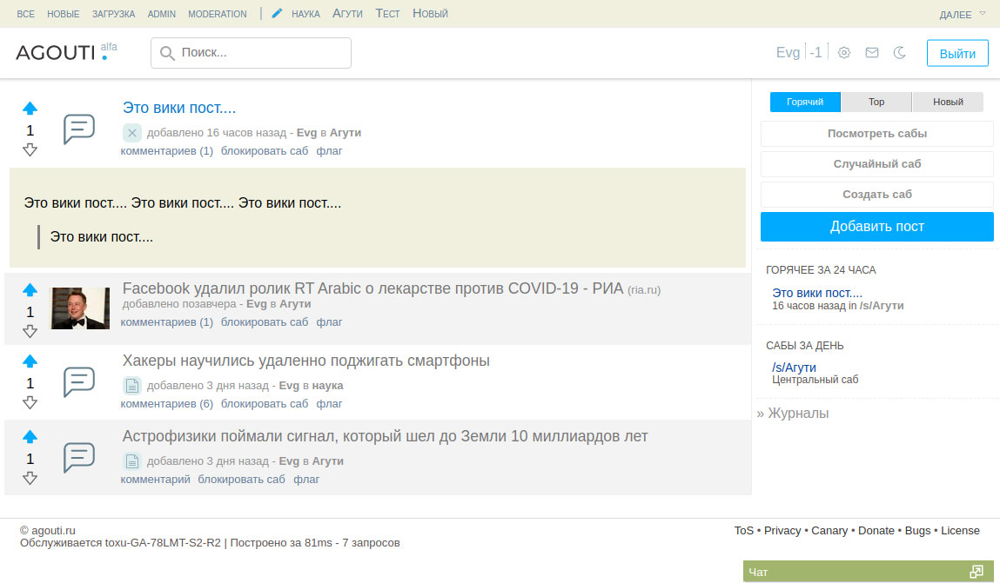

# AppThroat
Just a light modification

(This repository is the initial layout for the job ...)

Establish: https://github.com/Phuks-co/throat

1. Replace the files in the `app` folder
2. `npm run build`
3. You can run a test server by executing `./throat.py`

Just for reference. Just a working layout.

* Changed svg icons
* Some minor changes.
